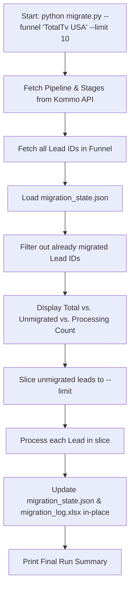

# Implementation Plan: Kommo to Chatwoot Data Migration Tool

Build a robust, reusable, and parameterized Python migration tool to migrate contacts, conversations, notes/messages, and pipeline stages from **Kommo CRM** to a self-hosted **Chatwoot** instance.

## User Review Required

> [!IMPORTANT]
> **Key Decisions & Requirements Aligned with Step 1**:
> 1. **Per-Funnel Migration**: One funnel/pipeline processed per run via `python migrate.py --funnel "<Funnel Name>"`.
> 2. **Chatwoot Pipeline Simulation**: Chatwoot conversations are labeled with `funnel-<slug>` and `stage-<slug>`.
> 3. **Safety Testing Cap**: Default `--limit` is **10 leads** per run; full funnel migration requires explicit `--limit 0` or higher.
> 4. **Dynamic Stage Resolution & Overrides**: Stages are discovered at runtime from Kommo and normalized via `stage_name_overrides.json`.
> 5. **Idempotency & Re-runs**: Local state tracking ensures re-running with higher limits seamlessly resumes without duplicating contacts, conversations, or messages.
> 6. **Single Running Excel Workbook**: Per-funnel sheets in `output/migration_log.xlsx` updated in-place by `Kommo Lead ID` using `openpyxl`.

---

## 1. Project Structure

```
kommo_chatwoot_migration/
├── migrate.py                      # Main CLI orchestrator
├── config.py                       # Environment and settings loader (.env)
├── stage_name_overrides.json       # Stage name correction dictionary
├── requirements.txt                # Project dependencies
├── .env.example                    # Template for credentials and endpoints
│
├── core/
│   ├── __init__.py
│   ├── kommo_client.py             # Kommo REST API v4 client (pipelines, leads, contacts, events)
│   ├── chatwoot_client.py          # Chatwoot REST API v1 client (contacts, conversations, messages, labels)
│   ├── stage_resolver.py           # Stage name resolution, overrides, and slugification
│   ├── state_tracker.py            # Idempotency engine (JSON/SQLite mapping file)
│   ├── report_generator.py         # openpyxl Excel migration logger (in-place row updater)
│   └── rate_limiter.py             # HTTP retry/backoff & rate limit handler
│
└── output/                         # Auto-created output directory
    ├── migration_state.json        # Idempotency mapping (kommo_lead_id -> chatwoot_conversation_id)
    └── migration_log.xlsx          # Multi-tab Excel report (one tab per funnel)
```

---

## 2. API Specifications

### A. Kommo REST API v4 Endpoints
* **Authentication**: `Authorization: Bearer <KOMMO_ACCESS_TOKEN>`
* **Base URL**: `https://<KOMMO_SUBDOMAIN>.kommo.com/api/v4`

| Action | Endpoint | Purpose |
| :--- | :--- | :--- |
| **Fetch Pipelines** | `GET /leads/pipelines` | Discover funnel by name and all its native stage IDs and stage names dynamically. |
| **Fetch Leads** | `GET /leads?filter[pipeline_id]=<id>&limit=250&page=<p>&with=contacts` | Page through all leads in the target funnel. |
| **Lead Details** | `GET /leads/<id>?with=contacts` | Retrieve lead price, custom fields, tags, and linked contact IDs. |
| **Contact Details**| `GET /contacts/<id>` | Extract first name, last name, phone number(s), and email(s). |
| **Lead/Contact Notes** | `GET /leads/<id>/notes`, `GET /contacts/<id>/notes` | Extract CRM notes and mirrored messages. |
| **Lead/Contact Events**| `GET /events?filter[entity]=lead&filter[entity_id][]=<id>` | Extract message event timestamps and conversation history dates. |
| **Talks (Metadata)** | `GET /talks?filter[entity_type]=lead&filter[entity_id][]=<id>` | Retrieve talk ID, origin channel, and chat ID. |

### B. Chatwoot REST API v1 Endpoints
* **Authentication**: `api_access_token: <CHATWOOT_API_TOKEN>` (Header)
* **Base URL**: `<CHATWOOT_BASE_URL>/api/v1/accounts/<CHATWOOT_ACCOUNT_ID>`

| Action | Endpoint | Payload / Parameters | Purpose |
| :--- | :--- | :--- | :--- |
| **Search Contact** | `GET /contacts/search?q=<phone_or_email>` | Query params: `q` | Avoid duplicate contact creation on re-runs. |
| **Create Contact** | `POST /contacts` | `{"name": "...", "email": "...", "phone_number": "+...", "custom_attributes": {"kommo_lead_id": 123}}` | Create new contact if not found. |
| **Update Contact** | `PUT /contacts/<id>` | `{"name": "...", "custom_attributes": {...}}` | Update existing contact details. |
| **Create Conversation** | `POST /conversations` | `{"inbox_id": <INBOX_ID>, "contact_id": <id>, "status": "resolved", "custom_attributes": {"kommo_lead_id": 123, "funnel": "TotalTv USA"}}` | Create conversation thread in the dedicated API inbox. |
| **Create Message** | `POST /conversations/<id>/messages` | `{"content": "[Original date: YYYY-MM-DD] <text>", "message_type": "incoming" \| "outgoing", "private": false}` | Insert messages in chronological order. |
| **Create Label** | `POST /labels` | `{"title": "funnel-totaltv-usa", "description": "...", "color": "#1f93ff", "show_on_sidebar": true}` | Create label if it doesn't already exist. |
| **Apply Labels** | `POST /conversations/<id>/labels` | `{"labels": ["funnel-totaltv-usa", "stage-trials"]}` | Attach funnel and stage labels to conversation. |

---

## 3. Stage Name Overrides (`stage_name_overrides.json`)

### Schema
```json
{
  "Remember Joinning": "Remember Joining",
  "Want to join?": "Want To Join",
  "Leads ganados": "Leads Ganados",
  "Leads perdidos": "Leads Perdidos",
  "en demo": "Demo Phase",
  "Aprovecha Promos": "Aprovecha Promociones"
}
```

### Resolution & Warning Workflow
1. Fetch stage name from Kommo (`status_name`).
2. Check `stage_name_overrides.json`:
   - If present: use corrected name.
   - If absent: use original Kommo name **and emit a warning log**:
     `[WARN] Stage '{status_name}' in pipeline '{pipeline_name}' has no override in stage_name_overrides.json. Using original name.`
3. Generate slugs:
   - Funnel label: `funnel-` + `slugify(funnel_name)` (e.g., `funnel-totaltv-usa`)
   - Stage label: `stage-` + `slugify(corrected_stage_name)` (e.g., `stage-remember-joining`)

---

## 4. Idempotency & Safety Cap Interaction

### State Tracker Schema (`output/migration_state.json`)
```json
{
  "funnels": {
    "TotalTv USA": {
      "pipeline_id": 6747643,
      "last_run_at": "2026-08-13T22:30:00Z",
      "leads": {
        "24636342": {
          "chatwoot_contact_id": 105,
          "chatwoot_conversation_id": 412,
          "stage_id": 56863491,
          "stage_name_kommo": "Trials",
          "stage_name_corrected": "Trials",
          "labels": ["funnel-totaltv-usa", "stage-trials"],
          "messages_migrated_count": 4,
          "last_message_date": "2026-08-01",
          "migrated_at": "2026-08-13",
          "status": "success",
          "error": null
        }
      }
    }
  }
}
```

### Execution Flow with `--limit` (Default: 10)


* **First run (`--limit 10`)**: Processes leads 1 to 10.
* **Second run (`--limit 10`)**: Skips leads 1 to 10, processes leads 11 to 20.
* **Full run (`--limit 0`)**: Skips already migrated leads, processes all remaining leads in the funnel.
* **`--force` flag**: Re-syncs contact details and updates stage labels in Chatwoot without duplicating conversation messages.

---

## 5. Excel Migration Log (`output/migration_log.xlsx`)

### Structure & Specifications
* Managed via `openpyxl`.
* **Single Workbook**: Saved to `LOCAL_REPORT_PATH` (default: `./output/migration_log.xlsx`).
* **One Tab Per Funnel**: Tab name matches the Funnel Name (e.g. `"TotalTv USA"`).

### Columns (Exact Order)
1. `Kommo Lead ID` (Key for in-place updates)
2. `Contact Name`
3. `Contact Phone`
4. `Contact Email`
5. `Funnel Name`
6. `Stage` (Corrected name)
7. `Chatwoot Contact ID`
8. `Chatwoot Conversation ID`
9. `Labels Applied` (e.g., `funnel-totaltv-usa, stage-trials`)
10. `Messages Migrated` (Count)
11. `Last Message Date` (Original date of most recent activity in Kommo)
12. `Migration Date` (Today's date: `YYYY-MM-DD`)
13. `Status` (`success` / `error`)
14. `Error Detail` (Blank if success, error message if failed)

### In-Place Row Matching & Lock Handling
* When a lead is processed, `report_generator.py` checks Column A of the funnel sheet:
  - If `lead_id` exists: updates that row in-place.
  - If `lead_id` is new: appends a new row at the bottom.
* **File Lock Protection**:
  ```python
  try:
      wb.save(file_path)
  except PermissionError:
      # Prompts user to close Excel without losing memory state
      input(f"[ERROR] Cannot save to '{file_path}'. File is open in Excel/LibreOffice. Please close it and press Enter to retry...")
      wb.save(file_path)
  ```

---

## 6. Error Handling & Rate Limiting Strategy

1. **Exponential Backoff**:
   - Automatic retry with jitter for `HTTP 429 Too Many Requests` and `HTTP 5xx Server Errors` on both Kommo and Chatwoot APIs.
2. **Lead-Level Fault Isolation**:
   - If a single lead encounters an error (e.g. malformed contact data or unexpected API response), the error is caught, logged in `migration_log.xlsx` and `migration_state.json` with `status: "error"`, and the batch proceeds to the next lead.
3. **Dry-Run Mode (`--dry-run`)**:
   - Runs full read logic from Kommo, runs stage normalization, simulates Chatwoot payloads and spreadsheet outputs, without making any write requests to Chatwoot.

---

## Verification Plan

### Automated & Manual Verification
1. **Dry-Run Verification (`--dry-run --funnel "TotalTv USA"`)**:
   - Confirm pipeline and stages resolve dynamically from Kommo.
   - Confirm stage name correction dictionary replaces `"Remember Joinning"` with `"Remember Joining"`.
   - Confirm warnings are logged for stages without overrides.
   - Confirm safety limit defaults to 10.
2. **First Batch Real Run (`--funnel "TotalTv USA"` with default 10 limit)**:
   - Verify 10 contacts and conversations created in Chatwoot API inbox with correct labels.
   - Inspect `output/migration_log.xlsx` tab `"TotalTv USA"` for 10 formatted rows.
   - Inspect `output/migration_state.json` for 10 tracked records.
3. **Idempotency Test (Re-run `--funnel "TotalTv USA"` with `--limit 10`)**:
   - Confirm the first 10 leads are skipped and the next 10 unmigrated leads (11-20) are processed.
   - Confirm existing rows in Excel are not duplicated.
